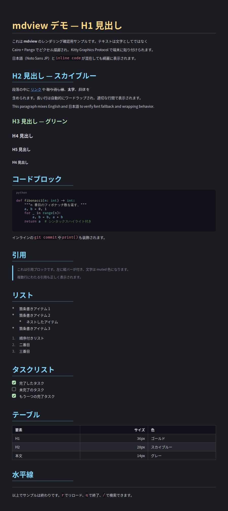

# mdview — ターミナル向け Markdown Viewer（Kitty Graphics Protocol）

[English README](README.md)

WezTerm / kitty で動作する Markdown ビューア。

**ポイント：テキストを文字として端末に出力せず、すべて Cairo + Pango でピクセル描画した
PNG を Kitty Graphics Protocol で貼り付ける。** これにより h1 と h2 で実際のフォント
サイズが異なる VSCode レベルのリッチ表示を実現する。



[](https://github.com/H1rla/markdown-on-kitty/actions/workflows/ci.yml)


---

## なぜ別の Markdown ビューアなのか

ターミナルの Markdown ツールはありふれているが、大半はこれとは別カテゴリ：

- **ANSI テキスト整形系**（`glow` / `rich` / `bat` / `mdless` …）は色や太字は付くが、
  各行は**端末セルの固定サイズ**のまま。h1 も本文も同じ高さ。
- **画像プロトコル併用系**（`mdcat`）は kitty/iTerm2/sixel で*埋め込み画像*を出せるが、
  本文テキストはやはり端末文字。

mdview は**本文テキストごと 1 枚の画像にラスタライズ**する。そのため h1/h2/h3 が
実フォントサイズ（36/28/22px）で描画され、数式・Mermaid は本物の画像になる。
トレードオフも正直に書くと、**テキストは選択不可**・**graphics 対応端末が必須**・
1 フレームの再描画は ANSI 出力より重い。速いページャが欲しければ `glow`、
「描画済みドキュメントのように見せたい」なら mdview。

---

## 特徴

- 見出し h1〜h6 が実フォントサイズで描画される（h1=36px ゴールド / h2=28px スカイブルー …）
- 段落のワードラップ・行間調整、**太字** / *斜体* / ~~取り消し線~~ / `インラインコード` / [リンク]()
- コードブロック（角丸背景・言語バッジ・Pygments シンタックスハイライト）
- 引用 / リスト / 順序付きリスト / ネスト / タスクリスト（チェックボックス）
- テーブル（ヘッダ背景・alt 行・セル整列・罫線）
- 水平線 / ローカル画像（リサイズ＋キャプション）
- **数式**（`$...$` / `$$...$$`）を Node の数式エンジンで画像化
- **Mermaid 図**（` ```mermaid `）を mermaid-cli で画像化
- スクロール、TOC ペイン、インクリメンタル検索、ステータスバー
- ズームイン/アウト（フォントをベクターのまま拡大するので滲まない）
- ファイル変更のホットリロード（watchfiles）/ リサイズ追従（SIGWINCH）
- `--safe`：信頼できない .md を外部レンダラを起動せずに閲覧

---

## 必要環境

- ターミナル: **WezTerm** または **kitty**（Kitty Graphics Protocol 対応）
- **Python 3.10+**
- システムライブラリ（ディストリ提供）: **pycairo** / **PyGObject** / **Pango**
- フォント: Noto Sans CJK（日本語）/ Fira Code（コード）
  - 見つからない場合は DejaVu Sans / 等幅フォントへ自動フォールバック

`pycairo` / `PyGObject` は C 拡張なので、ディストリのパッケージから入れるのが確実。
下記インストーラがこれらの導入状況を診断して案内する。

---

## インストール

最短はインストーラ。これは依存ドクターも兼ねており、OS を検出して**何が入っていて
何が足りないか**を ✓/✗/⚠ で表示し、不足分には**正確な導入コマンド**を出し、pip
パッケージはローカル `.venv` に導入する：

```bash
git clone https://github.com/H1rla/markdown-on-kitty
cd markdown-on-kitty
./install.sh            # 診断 + .venv 構築 + ランチャ生成
./install.sh --check-only   # 変更せず状態だけ表示
```

実行は生成されたランチャ（または素の Python）で：

```bash
.venv/bin/mdview sample.md
# または
python mdview/mdview.py sample.md
```

<details>
<summary>手動インストール（スクリプトを使わない場合）</summary>

```bash
# Arch Linux
sudo pacman -S python python-cairo python-gobject pango noto-fonts-cjk ttf-fira-code

# Debian / Ubuntu
sudo apt install python3 python3-gi python3-gi-cairo gir1.2-pango-1.0 \
                 fonts-noto-cjk fonts-firacode

# macOS (Homebrew)
brew install pango pygobject3 py3cairo

# その後、システムの pycairo/PyGObject が見える venv で：
python3 -m venv --system-site-packages .venv
.venv/bin/pip install -r requirements.txt
```
</details>

### 数式・Mermaid（任意 / Node.js が必要）

これらは**未導入でも動作し、その場合はソースを装飾ブロックとして表示する**
（フォールバック）。実際の図・数式にするには：

```bash
# 数式: MathJax v3（同梱の tex2svg.mjs が自動解決）
cd mdview && npm install && cd ..

# Mermaid: mermaid-cli（mmdc を PATH に通す）
npm install -g @mermaid-js/mermaid-cli
```

Mermaid は puppeteer 経由の headless Chromium で描画される。同梱の
`puppeteer-config.json` が `--no-sandbox` を渡し、Linux でよくある起動失敗を回避する。
トレードオフと `--safe` の使いどころは [SECURITY.md](SECURITY.md) を参照。

---

## 使い方

```bash
mdview README.md                 # 対話ビューア（WezTerm/kitty）
mdview untrusted.md --safe       # 外部レンダラ(数式/Mermaid)を起動しない
mdview --check                   # 依存・フォント・外部ツールを診断
mdview --version
```

### オフライン PNG 出力（ヘッドレス検証用）

TTY 非対応環境でも、全ページを PNG に書き出してレンダリングを確認できる：

```bash
mdview doc.md --render out.png --width 900
```

（ランチャ未生成なら `mdview` の代わりに `python mdview/mdview.py` を使う。）

---

## キーバインド

| キー | 動作 |
|------|------|
| `j` / `↓` | スクロール下 |
| `k` / `↑` | スクロール上 |
| `d` / `Ctrl-D` | 半ページ下 |
| `u` / `Ctrl-U` | 半ページ上 |
| `g` / `Home` | 先頭へ |
| `G` / `End` | 末尾へ |
| `/` | 検索モード（入力 → Enter で確定） |
| `n` / `N` | 次 / 前の検索結果 |
| `+` / `=` | ズームイン |
| `-` | ズームアウト |
| `0` | ズームをリセット（100%） |
| `r` | 手動リロード |
| `t` | TOC（目次）ペインのトグル |
| `q` | 終了 |

---

## セキュリティ

mdview はローカルビューアで、信頼境界は「開く .md ファイル」。本文レンダラは信頼できない
入力に対して安全（shell 注入なし・markup はエスケープ済み・HTML はテキスト表示）。
唯一リスクが上がるのは**任意の外部レンダラ**（Mermaid は `--no-sandbox` の headless
Chromium を起動する）。信頼できないファイルを開くときは **`--safe`** でこれらを無効化する。
詳細と報告手順は [SECURITY.md](SECURITY.md)。

---

## トラブルシューティング

ドクターを実行する。Python 依存・フォント解決・外部レンダラを検査し、各々をテスト描画する：

```bash
mdview --check          # または ./install.sh --check-only
```

数式/Mermaid がソース表示になる場合、どのツール（node / cairosvg / mmdc / mathjax-full）が
不足しているかと導入方法を `--check` が示す。数式のモジュール解決は `MDVIEW_NODE_PATH`、
Mermaid 実行ファイルは `MDVIEW_MMDC`、ブラウザは `MDVIEW_CHROME` で上書きできる。

---

## ファイル構成

```
mdview/
├── mdview.py    # エントリポイント・メインループ・初期化・SIGWINCH・CLI
├── parser.py    # Markdown(mistune) → 正規化 AST(Node[])
├── renderer.py  # AST → PNG（Cairo/Pango、全要素の描画）
├── external.py  # 任意の Node レンダラ（数式・Mermaid）+ --check ドクター
├── kitty.py     # Kitty Graphics Protocol 送受信・端末サイズ取得
├── layout.py    # 余白・行高の計算ヘルパ
├── input.py     # raw mode キーボード入力
├── watcher.py   # watchfiles ラッパー（ホットリロード）
└── theme.py     # カラースキーム・フォントサイズ・レイアウト定数
install.sh       # 依存ドクター + セットアップ
sample.md        # 全要素を含む確認用サンプル
```

---

## 設計メモ

- 本文描画はすべて Cairo/Pango で完結（`curses` 不使用、Sixel 不使用）。数式・Mermaid のみ
  純 Python で描画できないため任意の Node ツールに委譲する（未導入時はフォールバック表示）。
- 全ページを 1 枚の PNG にレンダリングし、ビューポート分を Pillow で切り出して送信する。
  ステータスバー・TOC は毎フレーム合成する。
- premultiplied alpha 変換は Pillow の C パス（純 Python ループではない）を使い、測定/描画
  パスで Pango レイアウトを共有するため、再描画が速い。
- フォント未インストール時はフォールバックし、`stderr` に警告を出す。

---

## ライセンス

[MIT](LICENSE) — フリー & オープンソース。著作権表示のみが条件。
