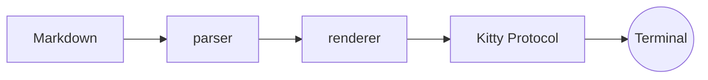

# mdview デモ — H1 見出し

これは **mdview** のレンダリング確認用サンプルです。テキストは文字としてではなく
Cairo + Pango で*ピクセル描画*され、Kitty Graphics Protocol で端末に貼り付けられます。
日本語（Noto Sans JP）と `inline code` が混在しても綺麗に表示されます。

## H2 見出し — スカイブルー

段落の中に [リンク](https://example.com) や ~~取り消し線~~、**太字**、*斜体* を
含められます。長い行は自動的にワードラップされ、適切な行間で表示されます。
This paragraph mixes English and 日本語 to verify font fallback and wrapping behavior.

### H3 見出し — グリーン

#### H4 見出し
##### H5 見出し
###### H6 見出し

## コードブロック

```python
def fibonacci(n: int) -> int:
    """n 番目のフィボナッチ数を返す。"""
    a, b = 0, 1
    for _ in range(n):
        a, b = b, a + b
    return a  # シンタックスハイライト付き
```

インラインの `git commit` や `print()` も装飾されます。

## 引用

> これは引用ブロックです。左に縦バーが付き、文字は muted 色になります。
> 複数行にわたる引用も正しく表示されます。

## リスト

- 箇条書きアイテム 1
- 箇条書きアイテム 2
  - ネストしたアイテム
- 箇条書きアイテム 3

1. 順序付きリスト
2. 二番目
3. 三番目

## タスクリスト

- [x] 完了したタスク
- [ ] 未完了のタスク
- [x] もう一つの完了タスク

## テーブル

| 要素 | サイズ | 色 |
|:-----|-------:|:--:|
| H1   |   36px | ゴールド |
| H2   |   28px | スカイブルー |
| 本文 |   14px | グレー |

## 数式（KaTeX / MathJax）

インライン数式は $e^{i\pi} + 1 = 0$ のように書けます。ブロック数式は次の通り：

$$
\int_{0}^{1} x^2 \, dx = \frac{1}{3}
$$

$$
\sum_{k=1}^{n} k = \frac{n(n+1)}{2}
$$

## Mermaid 図



## 水平線

---

以上でサンプルは終わりです。`r` でリロード、`q` で終了、`/` で検索できます。
